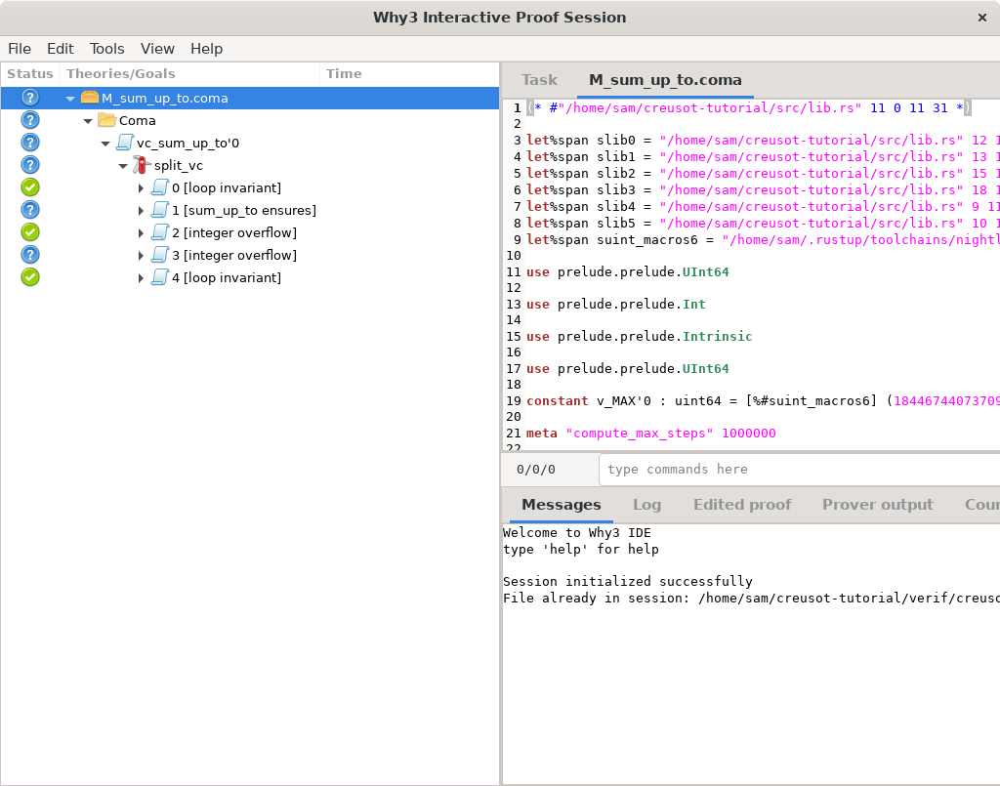
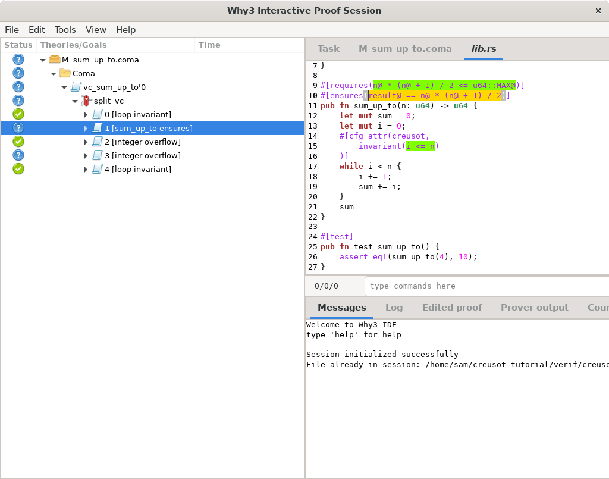

# Tutorial

This tutorial is an introduction to deductive verification with Creusot.
After introducing basic concepts, we will walk through the steps to verify a function with Creusot.

No prior knowledge about formal methods is required to follow this tutorial.
Basic familiarity with Rust should be enough to get started with Creusot.

## Creusot

Follow the [README](https://github.com/creusot-rs/creusot) to install Why3 and Creusot.

## Setup

Create a new project with this command:

```
cargo creusot new creusot-tutorial --creusot-contracts /PATH/TO/CREUSOT/creusot-contracts
```

This generates a directory `creusot-tutorial` containing the following files:

```
Cargo.toml
rust-toolchain
why3find.json
src/lib.rs
```

**Remark** The path `/PATH/TO/CREUSOT` should be either absolute, or relative to the `creusot-tutorial` directory to be created by that command,
not relative to the current directory.

The first three files contain package-level configuration settings. You may already be familiar with
`Cargo.toml` and `rust-toolchain`, generic files for Rust projects. The file `why3find.json` is
used by a verification tool invoked by Creusot. We will leave these files alone for this tutorial.

The last file, `src/lib.rs`, is what we will be editing in this tutorial.

## My first contract

Open `src/lib.rs`. It contains an example function with a *contract*:

```rust
use creusot_contracts::*;

#[requires(x@ < i64::MAX@)]
#[ensures(result@ == x@ + 1)]
pub fn add_one(x: i64) -> i64 {
    x + 1
}
```

In Creusot, contracts are how we specify the expected behavior of functions.
A contract contains two kinds of assertions: *preconditions*, or "required clauses",
describe the values of arguments that the function accepts;
*postconditions*, or "ensured clauses", describe the result value that the function returns.

In this first example, there is one precondition (`requires`) and one postcondition (`ensures`).
This contract can be read as follows: if the argument `x` is smaller than `i64::MAX`,
then the value of `add_one(x)` will be equal to `x@ + 1`.

More generally, a function *satisfies its contract* when, for any input arguments that satisfy
the preconditions (`requires`), the result of the function satisfies the postcondition (`ensures`).

It is not a very exciting contract, since it just replicates the body of the function `x + 1`.
But note that `x@ + 1` is not exactly the same expression. The `@` suffix is Creusot's *view operator*,
which maps a Rust value to a mathematical value. If `x` has type `i64`, then `x@` has type `Int`,
as the type of mathematical integers (..., -2, -1, 0, 1, 2, ...).
The key difference is that mathematical integers are unbounded: their arithmetic operations do not overflow.
They are more intuitive and better behaved than operations on machine integer.
For example, all `x: Int` satisfy `x < x + 1` whereas this cannot be true for Rust's machine integers because they are finite.

The type `Int` is one of several built-in types of common mathematical objects defined by Creusot;
others include sequences and mappings (mathematical functions).
On the one hand, mathematical objects like `Int` cannot be manipulated by Rust programs, they can only be used in contracts.
On the other hand, values that exist in Rust programs such as machine integers (`i64`, etc.) are not as easy to manipulate
in the logical world of contracts, so we use the view operator `@` to transform them into something more intuitive.

The contract of `add_one` specifies the result slightly indirectly: its view as an unbounded integer, denoted by `result@`,
must be equal to `x@ + 1`. Note that arithmetic operations are only defined on `Int` in the logical world of contracts.

### Verifying the contract

```
cargo creusot prove
```

First, the Rust code is compiled to Coma, an intermediate verification language in the Why3 platform.
Second, Why3 verifies the compiled program by generating verification conditions and sending them as queries to SMT solvers.
When all verification conditions have been proved, that amounts to proving that functions defined in our crate satisfy their contracts.

## My second contract

Here is a more involved example: given a non-negative integer `n`, compute the sum of all integers between `0` and `n` included.
We can do this simply by iterating through each integer up to `n`. This is the function to verify.

```rust
pub fn sum_up_to(n: u64) -> u64 {
    let mut sum = 0;
    let mut i = 0;
    while i < n {
        i += 1;
        sum += i;
    }
    sum
}
```

Although a `for` loop would be idiomatic, that also adds some complications to the verification process.
For the sake of simplicity, we start with a `while` loop, and switch to a `for` loop at the end.

As a sanity check, we can write unit tests:

```rust
#[test]
pub fn test_sum_up_to() {
    // 1 + 2 + 3 + 4 = 10
    assert_eq!(sum_up_to(4), 10);
}
```

Run with

```
cargo test
```

Whereas unit tests let us check the output associated with specific inputs of a function,
contracts let us specify the output for all possible inputs. Naturally, we can't exhaustively
list input-output pairs. Instead, we describe the relation between inputs and outputs as
properties, logical formulas that are true about the inputs and outputs of a function.

### Contract

The result of this sum is also known as the [triangular numbers](https://en.wikipedia.org/wiki/Triangular_number),
with a well-known formula: `n * (n + 1) / 2`. This provides a nice and concise specification for `sum_up_to`.

Write an `#[ensures(...)]` clause to give a postcondition to `sum_up_to` using the formula for triangular numbers.

<details>
<summary>
Added postcondition
</summary>

```rust
#[ensures(result@ == n@ * (n@ + 1) / 2)]
pub fn sum_up_to(n: u64) -> u64 {
    // ...
}
```
</details>

Run `cargo creusot` to make sure that the postcondition is well-formed.
Of course, `cargo creusot prove` will fail. The contract is still too naive at this point.

What if the sum overflows? Feel free to try different approaches to handle this problem.
Here is a non-exhaustive list of possibilities.

<details>
<summary>
Add a simple bound on the input as a precondition
</summary>

```rust
#[requires(n@ < 1000)]
#[ensures(result@ == n@ * (n@ + 1) / 2)]
pub fn sum_up_to(n: u64) -> u64 {
    // ...
}
```
</details>

<details>
<summary>
Add a more precise upper bound as a precondition
</summary>

```rust
#[requires(n@ * (n@ + 1) / 2 <= u64::MAX@)]
#[ensures(result@ == n@ * (n@ + 1) / 2)]
pub fn sum_up_to(n: u64) -> u64 {
    // ...
}
```
</details>

<details>
<summary>
Allow overflows and adjust the postcondition accordingly
</summary>

```rust
#[ensures(result@ == (n@ * (n@ + 1) / 2) % (u64::MAX + 1))]
pub fn sum_up_to(n: u64) -> u64 {
    // ...
}
```
</details>

<details>
<summary>
Change the result type to be big enough
</summary>

```rust
#[ensures(result@ == n@ * (n@ + 1) / 2)]
pub fn sum_up_to(n: u64) -> u128 {
    // ...
}
```
</details>

At this point, you may have a contract that is satisfied by the function,
but `cargo creusot prove` still can't verify it. This function contains a loop,
and loops must be annotated with *loop invariants*: assertions which must be true
at every iteration of the loop.

### Loop invariants

A loop invariant looks like this:

```rust
    #[cfg_attr(creusot,
        invariant(i@ <= n@)
    )]
    while i < n {
        i += 1;
        sum += i;
    }
```

At every step, `i` is less than or equal to `n`. In particular, it is true when we enter the loop (when `i = 0`),
inside the loop body it must have been that `i < n`, which gives us `i+1 <= n`, with `i+1` as the next value of `i`,
and when we exit, the loop condition `i < n` is false, which combined with the invariant `i@ <= n@` tells us that `i = n`
when the function returns. We could have written this invariant as `i <= n`, without the `@`.

### Inspecting proofs with Why3 IDE

The invariant is still incomplete.
To investigate what's missing, we can inspect proofs in progress with Why3 IDE.
The command `cargo creusot prove` with the `-i` option launches Why3 IDE, showing
the proof state for an as yet unverified function.

```
cargo creusot prove -i
```

If there are many functions to verify, we can pick a specific one on the command line
by naming the Coma file it was compiled to. Coma files are generated in the `verif/` directory,
and their path consists of the crate name (`creusot_tutorial_rlib` for the library `creusot-tutorial`)
followed by the fully qualified function name (`creusot_tutorial::sum_up_to` becomes `creusot_tutorial/M_sum_up_to.coma`).

```
cargo creusot prove -i verif/creusot_tutorial_rlib/creusot_tutorial/M_sum_up_to.coma
```

Why3 IDE is a GUI that looks like this:



It's a three-pane window. The left panel displays the tree of goals to prove.
The top right panel displays the proof context, which consists of relevant source files
and a special *Task* tab listing available hypotheses and the goal formula.
The bottom right panel contains error messages and other logs.

In the left panel, the status of every tree node is shown as an icon in the leftmost column.
Goals with complete proofs have green checkmarks, unproved goals have blue question marks.
Currently, the bottom of the tree consists of five subgoals labeled `[loop invariant]`,
`[sum_up_to ensures]`, `[integer overflow]` twice, and `[loop invariant]` again.

To verify that a function satisfies its contract, Why3 generates *verification conditions*
which represent properties that must hold at certain points in the program:

1. Starting from the top of the function `sum_up_to`, we must check that the loop invariant
holds when we enter the loop, that corresponds to the first `[loop invariant]` goal.

2. Inside the loop, we show that any iteration of the loop body preserves the loop invariant:
we start with arbitrary values of `i` and `sum` assuming that the loop invariant holds
and that the condition `i < n` is true.
Checking that `i += 1` does not overflow corresponds to the first `[integer overflow]` goal.
Checking that `sum += i` does not overflow corresponds to the second `[integer overflow]` goal.

3. At the end of the loop body the invariant must hold again, corresponding to the last `[loop invariant]` goal.

Finally, at the loop exit, we assume that the loop invariant holds and that the condition `i < n` is false,
and prove that the returned value satisfies the postcondition (`ensures` clause), which corresponds to the
`[sum_up_to ensures]` goal. It may seem surprising that the goal `[sum_up_to ensures]` appears first even though
it corresponds to the end of the function;
this is due to internal details of compiling the program to a control-flow graph and generating verification
conditions by traversing the control-flow graph in a somewhat arbitrary order.

One way to make sense of the goals is to look at the source spans they contain.
In the left panel, click on the goal labeled `[sum_up_to ensures]`.
That opens a tab `lib.rs` on the top right panel; click on it.



We see a view of the Rust code we are trying to verify,
with highlighted spans relevant to the goal we selected.
What we are trying to prove is highlighted in yellow:
the goal `[sum_up_to ensures]`, as its name indicates, is trying to prove that the
`ensures` clause holds when the function returns.
Hypotheses and various bits of code that the goal depends on are highlighted in green:
the `requires` clause and the loop `invariant` are hypotheses.

Similarly, you can inspect the two `[loop invariant]` goals. Both will highlight
the invariant `i <= n` in yellow, but there will be a difference in the surrounding spans:
one goal will highlight the `0` from the initialization of `i`, indicating that the goal
comes from entering the loop, whereas the other goal will highlight the `1` in the
increment `i += 1`, indicating that the goal comes from checking that the loop body maintains the
loop invariant.

It is easy to prove that the addition in `i += 1` will not overflow, because the loop condition `i < n`
is true. However we cannot deduce that the addition in `sum += i` will not overflow yet, because
we know nothing about `sum` in the loop invariant.
For that same reason, there is also no way to prove the postcondition (`[sum_up_to ensures]`).

### Complete the loop invariant

Complete the invariant. Below we extended the invariant with a placeholder for your solution.
Intuitively, the invariant should reflect the idea that at every step, `sum` is the sum of numbers from `0` to `i` included.

```rust
    #[cfg_attr(creusot,
        invariant(i@ <= n@),
        invariant(true /* YOUR INVARIANT HERE */)
    )]
    while i < n {
        i += 1;
        sum += i;
    }
```

<details>
<summary>
Completed invariant
</summary>

```rust
    #[cfg_attr(creusot,
        invariant(i@ <= n@),
        invariant(sum@ == i@ * (i@ + 1) / 2)
    )]
    while i < n {
        i += 1;
        sum += i;
    }
```
</details>

With that, `cargo creusot prove` succeeds. We have proved that the function `sum_up_to` satisfies its contract.

<details>
<summary>
Complete <code>sum_up_to</code> function with all annotations
</summary>

```rust
#[requires(n@ * (n@ + 1) / 2 <= u64::MAX@)]
#[ensures(result@ == n@ * (n@ + 1) / 2)]
pub fn sum_up_to(n: u64) -> u64 {
    let mut sum = 0;
    let mut i = 0;
    #[cfg_attr(creusot,
        invariant(i@ <= n@),
        invariant(sum@ == i@ * (i@ + 1) / 2)
    )]
    while i < n {
        i += 1;
        sum += i;
    }
    sum
}
```
</details>

### Use a `for` loop

The `while` loop above can be replaced with a more idiomatic `for` loop.

```rust
    for i in 1..=n {
        sum += i;
    }
```

Verifying a `for` loop is more complicated because we must reason about iterators.
Another challenge is that the invariant cannot talk about the next value (`i`):
there might not be a next value.

Creusot defines a special variable, `produced`, which contains the sequence of elements
previously produced by the iterator of a `for` loop.
Using that variable, we can restate the invariant about `sum`:

```rust
    #[cfg_attr(creusot,
        invariant(sum@ == produced.len() * (produced.len() + 1) / 2)
    )]
    for i in 1..=n {
        sum += i;
    }
```

Indeed, `produced.len()` is exactly the number of past iterations.

We no longer need the other clause of the invariant, `i <= n`,
first because `i` isn't even in scope in the invariant,
and also because that fact will be deduced automatically from the
postcondition of `next` for the iterator `1..=n`, which is where `i` comes from.

We are almost done. In principle, that invariant should be all we need to complete the proof.
But the solvers can't figure it out for some reason. It may be that solvers have trouble with division.
We can tweak the invariant to avoid relying on division, and the proof goes through.

```rust
    #[cfg_attr(creusot,
        invariant(sum@ * 2 == produced.len() * (produced.len() + 1))
    )]
    for i in 1..=n {
        sum += i;
    }
```

This kind of wrinkle is par for the course in SMT-based tools such as Creusot.

<details>
<summary>
Complete <code>sum_up_to</code> function with all annotations (<code>for</code> loop version)
</summary>

```rust
#[requires(n@ * (n@ + 1) / 2 <= u64::MAX@)]
#[ensures(result@ == n@ * (n@ + 1) / 2)]
pub fn sum_up_to(n: u64) -> u64 {
    let mut sum = 0;
    #[cfg_attr(creusot,
        invariant(sum@ * 2 == produced.len() * (produced.len() + 1)),
    )]
    for i in 1..=n {
        sum += i;
    }
    sum
}
```
</details>

## Conclusion

In this tutorial, we've got a glimpse of the workflow of verifying a Rust program in Creusot.

We have only scratched the surface. Creusot offers many more features for verifying Rust code at large.
You can read about them in the rest of this user guide.
